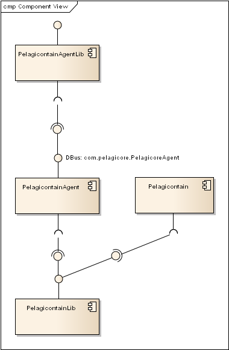

# Introduction and Goals

Pelagicontain (aka Software Container) is used to run applications in a contained environment where access to the main system can be customized using a set of gateways. It is using LXC to setup and control the containers, which in turn is based on kernel namespaces.

# Constraints

# Context

# Solution Ideas and Strategy
## Introduction

Pelagicontain consist of a few different parts
- pelagicontain-agent
- pelagicontain-agent-lib
- libpelagicontain
- pelagicontain

Pelagicontain is written in C++, it and uses glibmm for e.g. mainloop and signal handling. It currently use dbus-c++ for DBus access, but this should moved to glibmm as well in the future.

### pelagicontain-agent
Pelagicontain-agent is a DBus service which you can communicate with to start and control apps running in containers. One benefit of having this functionality exposed as a DBus service is that it can run as root and then allow the users of the service to run as non-root user and still be able to create and configure containers.

An instance of pelagicontain-agent handles multiple containers.

### libpelagicontain-agent
This is a library for interfacing with pelagicontain-agent over DBus, making it convenient to use from C++.

### libpelagicontain
A library which allows you to create and manage containers, used by both pelagicontain-agent and the stand-alone pelagicontain.

### pelagicontain
A stand-alone binary for launching an application in a container. Should be largely obsoleted by pelagicontain-agent, but is current kept for backwards compatibility.

An instance of pelagicontain handles only one container.

# Building Block View

# Runtime View

# Deployment View

# Concepts

# Design Decisions

# Quality Scenarios

# Risks

# Glossary

- RAM - Resource Access Manager
- SC - Software Container

# Document TODO
List of tasks related to this documentation.